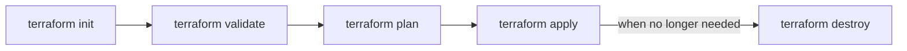

# Learning Terraform (IaC)

This repository contains my first steps learning **Terraform** for **Infrastructure as Code (IaC)**.  
Here are the CLI commands I have learned.  

---

## Prerequisites
- AWS CLI configured with **SSO authentication**  
- Terraform installed on your machine  

---

## Terraform Workflow

### 1. Initialize the project  
```bash
terraform init
```

### 2. Validate configuration  
```bash
terraform validate
```

### 3. Preview changes  
```bash
terraform plan
```
so far
### 4. Apply changes  
```bash
terraform apply
```

To skip manual approval:  
```bash
terraform apply -auto-approve
```

### 5. Destroy infrastructure  
```bash
terraform destroy
```

---

## Visual Workflow



---

## Notes
- Always run `terraform plan` before `apply`.  
- Use `-auto-approve` with caution, since it bypasses the confirmation step.  